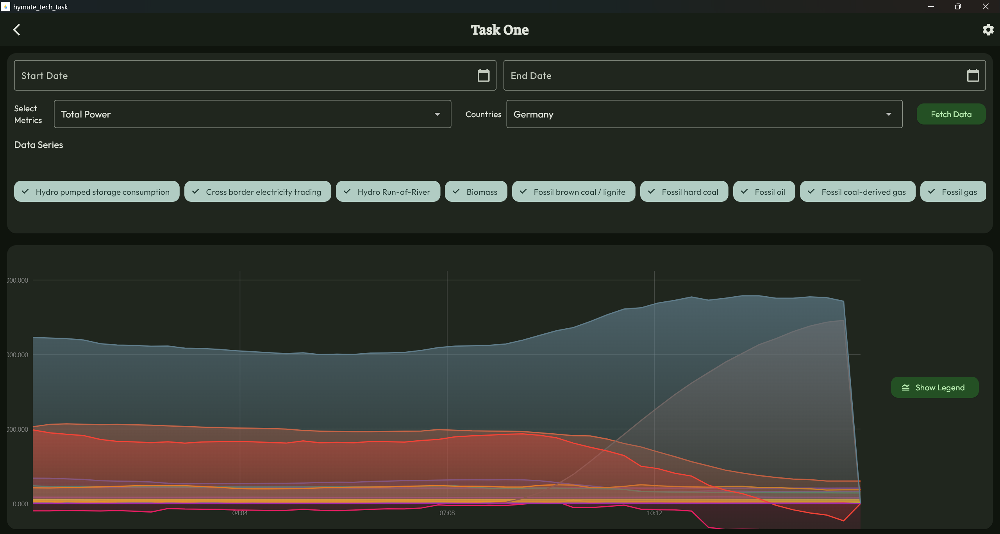
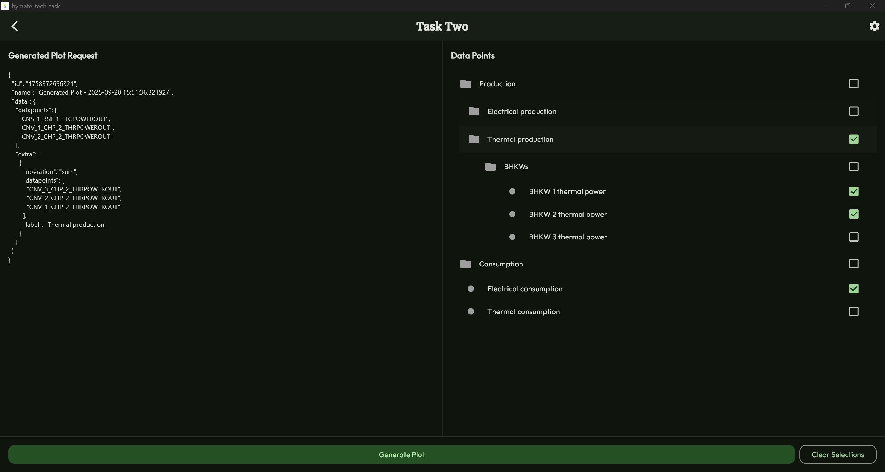

# hymate_tech_task

Flutter Tech Task for Hymate
---

## 🚀 Setup Instructions

Follow these steps to get the project up and running on your local machine.

1. **Clone the repository:**
   ```bash
   git clone [https://github.com/JDMukiibs/hymate_tech_task.git](https://github.com/JDMukiibs/hymate_tech_task.git)
   cd your-repo-name
   ```
2. **Install dependencies:**
   ```bash
   melos bootstrap
   flutter pub get
   ```
3. **Run the application:**
   ```bash
   flutter run
   ```
   (You may need to specify a device or browser for desktop/web: `flutter run -d chrome` or
   `flutter run -d windows`)

---

## 🛠️ Flutter & Dart SDK Used

* **Flutter Version:** `3.32.6`
* **Dart Version:** `3.8.1`

You can find your current versions by running `flutter --version` in your terminal.

---

## Screenshots / Video of the Implementation

| Task 1                        | Task 2                        |
|-------------------------------|-------------------------------|
|  |  |

---

## 📝 Small Description of the Implementation

This section provides a high-level overview of how the application is structured and key technical
decisions.

* **Architecture:**
    * Feature-based folder structure with separation of concerns (models, views,
      providers/controllers, services, widgets).
    * Uses Flutter Riverpod for state management.
    * Package-based modularization with Melos for managing multiple packages.

* **Key Features Implemented:**
    * Chart visualization for energy data
    * Interactive controls for selecting date ranges with time, metrics, and series
    * Responsive design for desktop and web platforms
    * Error handling for network requests and data parsing
    * Custom theming and styling for a polished UI

* **Core Libraries/Packages:**
    * `custom_charts`: The custom charting package developed as part of the task with coordination
      between multiple series, legends, and axes.
    * `flutter_riverpod`: For state management and dependency injection.
    * `dio`: For making network requests to fetch data.
    * `dio_cache_interceptor`: For caching network responses.
    * `json_serializable`: For JSON parsing and model generation.
    * `reactive_forms`: For managing form state and validation.

* **Data Handling:**
    * Task One uses an api service to fetch data from the given data source:
      `https://api.energy-charts.info/`
    * Data is parsed into Dart models using `json_serializable`.
    * Error handling is implemented for network requests and data parsing.
    * A simple in-memory caching layer is used to avoid redundant network requests with the help of
      DioCacheInterceptor.

---

## 💡 Notes about Assumptions, Limitations, or Extra Work Done

* **Assumptions:**
    * Task One:
        * The data source is reliable and returns data in the expected format.
        * Date ranges are inclusive of the start and end dates.
        * For `total_power` metric, for some production types particularly "Hydro Pumped Storage
          consumption" and "Cross border electricity trading", negative values are possible and
          should be displayed as-is.
    * Task Two:
        * For Plot and Graph the actual API response would fill out the values to be plotted.
        *
* **Limitations:**
    * A mem cache is what is used for the caching layer, which means that data is lost when the app
      is restarted. A more robust caching solution (e.g., local database or file storage) would be
      needed for a production app.
    * Ensuring different colors are used for different hierarchical levels in the chart is not
      implemented.
    * In Task One, I had to make some assumptions about how to handle missing data points
      (e.g., gaps in time series) and how to aggregate data for different time ranges (e.g., daily,
      weekly).
    * In Task One, some requests are not being made with the correctly set input parameters for
      bidding zone and country. And so at times, the intended request fails or returns a previous
      request's data and not the intended one. The problem is mainly with my reactive form setup
      that I couldn't debug in time.
    * The charting package is basic and may not cover all edge cases or advanced features found in
      mature charting libraries.
    * The UI is designed primarily for desktop and web; mobile support is not fully optimized.
    * Some error handling is basic and could be improved for a production app.
    * No extensive unit/integration tests are included due to time constraints.
* **Extra Work Done:**
    * Implemented a custom theme to match a specific brand guide.
    * Created a custom package for charting with help from an LLM as I've not spent plenty of time
      with charts in Flutter.
    * Created some resuable widgets for common UI elements (e.g., buttons, dropdowns).
    * Added performance tests for JSON parsing to ensure efficiency with large datasets.
    * Setup Melos for managing multiple packages in a monorepo structure.
    * Setup linting and formatting rules for consistent code style.
    * Setup localization support using `flutter_localizations` package. (German mostly Gemini
      translation)
    * Setup app_prefernces so that user selections (language, theme*) are persisted across app
      restarts.

---

## ⏱️ Time Spent on Each Task

For your reference, here's an estimate of time spent on key tasks:

* **Project Setup & Environment Configuration:** `2.5 hours`
* **Core Chart Implementation:** `7 hours`
* **Data Integration (Mock/API):** `13 hours`
* **UI/UX (Layout, Styling, Responsiveness):** `15 hours`
* **Error Handling & Edge Cases:** `2 hours`
* **README Documentation:** `1 hour`
* **Total Estimated Time:** `40.5 hours`

---

## 🧪 Performance tests (parsing) -- Copilot

A set of performance-focused tests live under `test/perf/parse_performance_test.dart`. These tests
measure
how long it takes to parse large JSON responses into the project's `DatapointHierarchyNode` model.
They
are separated from the fast unit tests so you can run them manually when you want reliable timing
data.

What is measured

- jsonDecode (string -> Map/List) time.
- The generated `fromJson` model mapping time (Map -> `DatapointHierarchyNode`).

Test characteristics

- Each test runs a small warm-up phase to stabilize JIT/VM behavior.
- Each measurement runs multiple iterations and reports median and average timings to reduce noise.
- Timings are printed in human-friendly units (milliseconds/ms or seconds/s) for easier
  interpretation.

Included benchmarks

- Depth benchmark: measures parsing when JSON is very deep (single chain of nested children). Useful
  to
  check stack/recursion and per-node parsing costs.
- Width benchmark: measures parsing when JSON has many sibling nodes at one level (wide trees).
  Useful to
  check the impact of large payload sizes and many sibling objects.

How to run (Windows cmd.exe)

- Run only the performance tests (recommended):

```cmd
flutter test test\perf\parse_performance_test.dart -r expanded
```

- Run a single test file (same as above) or the whole test suite if you prefer.

Interpreting the outputs

- Each benchmark prints median and average timings for both the decode and fromJson stages.
- Timings are printed as either `XXX.X ms` or `Y.YYY s` depending on magnitude.
- Prefer the median for stability (less sensitive to outliers). You can use the average to
  understand total
  runtime across iterations.

Recommendations

- Run these perf tests on the same machine/environment when comparing results to avoid cross-machine
  variance.
- Run them manually (they are under `test/perf/`) rather than as part of CI unless you want a
  performance
  gating policy (in which case choose conservative thresholds).

Example output (abbreviated)

- Depth 100 decode median=1.2 ms avg=1.4 ms
- Depth 100 fromJson median=0.12 ms avg=0.14 ms
- Width 200 decode median=0.20 ms avg=0.19 ms
- Width 200 fromJson median=0.06 ms avg=0.06 ms

---

